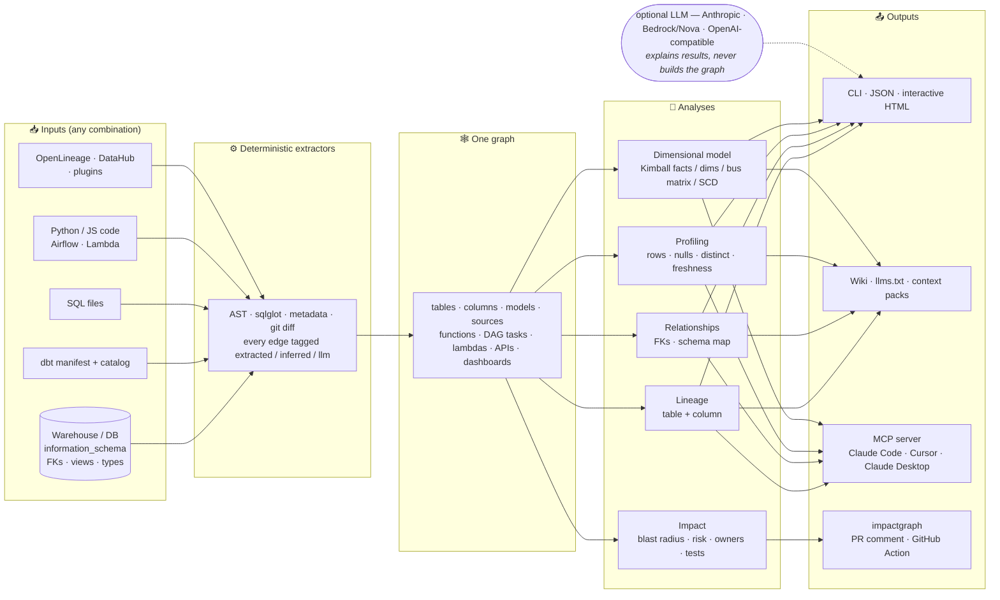
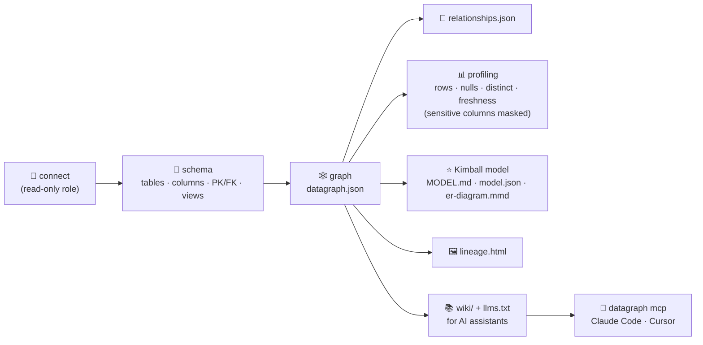
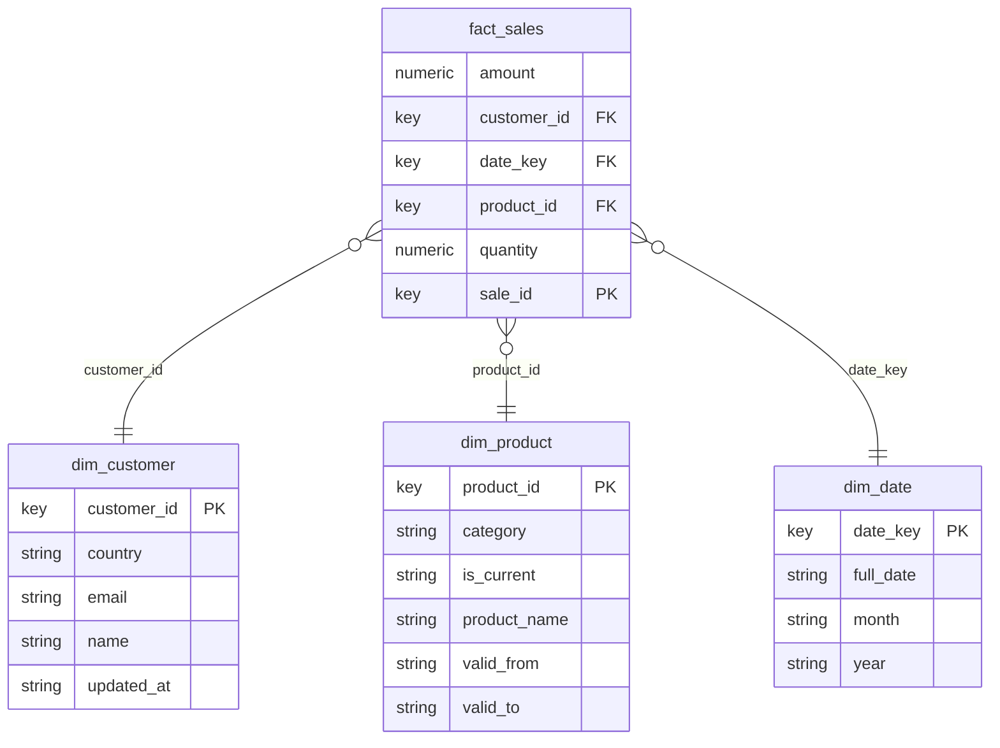
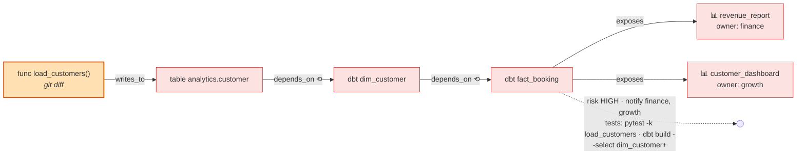

<h1 align="center">datagraph</h1>

<p align="center">
  <b>The open-source data engine: lineage · relationships · data profiling · dimensional modelling · knowledge graph for AI assistants</b><br>
  built <i>deterministically</i> from your database, dbt project, SQL and code — no LLM in the loop.
</p>

<p align="center">
  <a href="https://pypi.org/project/datagraph-core/"></a>
  <a href="https://pypi.org/project/datagraph-core/"></a>
  <a href="https://github.com/sumit-gupta03/datagraph/actions/workflows/ci.yml"></a>
  <a href="https://github.com/sumit-gupta03/datagraph/blob/main/LICENSE"></a>
  <a href="https://pypi.org/project/impactgraph/"></a>
</p>

```bash
pip install "datagraph-core[sql]"
datagraph analyze --warehouse "snowflake://user:pw@account/db" --schemas analytics -o out/
#  -> lineage.html · relationships.json · MODEL.md + er-diagram.mmd · profiles · wiki/ (for AI assistants) · datagraph.json
```

> **Brownfield data platform, hundreds of tables, no documentation?** One command turns the schema (and dbt / SQL / code if you have them)
> into a graph you can query: where does this come from, what does it feed, how are the tables related, what does the data look like,
> what is the dimensional model, what breaks if I change this — and hands the same graph to your AI assistant over MCP.

## How it works



<p align="center">
  <br>
  <em>Real output: <code>datagraph lineage customers --html</code> on dbt's public jaffle_shop project — upstream through staging models to seed files, downstream to the table and its columns.</em>
</p>

## Why datagraph

| You ask | datagraph answers with | From |
|---|---|---|
| Where does this table / column come from, what does it feed? | column-level lineage, interactive HTML, JSON | `lineage` |
| How are my tables related? | foreign keys, view lineage, per-table column map | `relationships` |
| What does the data look like? | row counts, freshness, null %, distinct, min/max, top values (sensitive columns masked) | `profile` |
| What is my dimensional model — is it sound? | Kimball facts / dimensions / bridges, bus matrix, grain, SCD types, issues; star-schema proposal from a wide table | `model` |
| Give my AI assistant the context | `context` packs, Markdown wiki + `llms.txt`, stdio MCP server | `context` · `wiki` · `mcp` |
| If I change this, what breaks? | blast radius, risk score, owners, test plan; PR comment via impactgraph | `impact` · `diff` |

**Principles:** the graph is built deterministically from artifacts (never by an LLM) · every edge carries provenance (`extracted` / `inferred` / `llm`) and `--no-inferred` strips heuristics · nothing to deploy — pip, one JSON file, runs in CI · secrets never stored, personal data masked · LLMs are optional and only *explain*.

> **New here?** Run the guided tour - it builds a demo warehouse and walks through every feature with real output:
> ```bash
> python examples/example_datagraph.py
> ```

## Contents

1. [Install](#install)
2. [The standard flow: connection in → lineage, profiling, model out](#the-standard-flow-connection-in--lineage-profiling-model-out)
3. [What goes into the graph](#what-goes-into-the-graph)
4. [Commands](#commands)
5. [Dimensional modelling](#dimensional-modelling)
6. [Data profiling](#data-profiling)
7. [Knowledge base & MCP for AI assistants](#knowledge-base--mcp-for-ai-assistants)
8. [Impact analysis & the impactgraph companion](#impact-analysis--the-impactgraph-companion)
9. [Python API](#python-api)
10. [Security](#security)
11. [How it compares](#how-it-compares-graphify--datahub--openlineage--datagraph)
12. [Node ids, provenance, propagation](#node-ids-provenance-propagation)
13. [Development & roadmap](#development)

## Install

```bash
pip install datagraph-core              # core: graph, warehouse/dbt/code extractors, lineage, profiling, modelling, wiki
pip install "datagraph-core[sql]"       # + sqlglot: SQL files, view definitions, column-level lineage   (recommended)
pip install "datagraph-core[mcp]"       # + MCP server for Claude Code / Claude Desktop / Cursor
pip install "datagraph-core[ai]"        # + Anthropic Claude for explanations / LLM lineage fallback
pip install "datagraph-core[bedrock]"   # + Amazon Bedrock (Nova, Claude on Bedrock, Llama ...) for the same; OpenAI-compatible needs nothing extra
pip install "datagraph-core[all]"       # everything (also PyYAML for YAML lineage files / serverless.yml)
```

The PyPI distribution is **`datagraph-core`** (the bare name `datagraph` is not allowed on PyPI); the import name, CLI and MCP server are all `datagraph`:
`pip install datagraph-core` → `import datagraph` / `datagraph analyze …`.

Database drivers: SQLite and DuckDB files work out of the box; for Snowflake / Postgres / BigQuery / Redshift / MySQL / SQL Server
install SQLAlchemy plus the driver and pass a SQLAlchemy URL (or pass an open DB-API connection from Python).
From source: `pip install "datagraph-core[sql] @ git+https://github.com/sumit-gupta03/datagraph"`.

## The standard flow: connection in → lineage, profiling, model out

```bash
datagraph analyze --warehouse "snowflake://user:pw@account/db" --schemas analytics,raw -o out/
datagraph analyze --warehouse warehouse.db -o out/            # a SQLite / DuckDB file works too
```



One command runs the standard sequence (use a **read-only** database role; the password is never stored or logged):

| Step | What datagraph does | Output in `out/` |
|---|---|---|
| connect | opens the connection (`sqlite` / `duckdb` file, or any SQLAlchemy URL) | — |
| schema | reads `information_schema`: tables, views, columns + types, primary & foreign keys, view definitions → graph | `datagraph.json` |
| relationships | table↔table and column↔column relationships (FKs, view lineage), per-table column lists | `relationships.json` |
| profiling | row count, freshness, per-column null %, distinct, min/max, top values (sampled); sensitive-looking columns masked | stored on the graph |
| dimensional model | Kimball: facts, dimensions, bridges, bus matrix, grain, measures & additivity, SCD types, conformed dimensions, issues | `MODEL.md`, `model.json`, `er-diagram.mmd` |
| lineage view | interactive HTML of the whole graph | `lineage.html` |
| knowledge base | `index.md`, one page per table, `GRAPH_REPORT.md`, `MODEL.md`, `llms.txt` | `wiki/` |

Then ask questions against the saved graph:

```bash
datagraph lineage fact_sales --graph out/datagraph.json            # upstream / downstream (add --html lineage.html)
datagraph relationships --graph out/datagraph.json --search customer
datagraph context dim_customer --graph out/datagraph.json          # compact knowledge pack for an assistant
datagraph model --graph out/datagraph.json --from-table wide_orders
datagraph mcp --graph out/datagraph.json                           # MCP server for your coding assistant
```

Options: `--schemas a,b` · `--database NAME` · `--dialect snowflake|postgres|bigquery|…` (for view SQL) · `--no-profile` (metadata only) ·
`--sample N` · `--no-top-values` · `--no-inferred` (declared foreign keys only) · `--json`.

## What goes into the graph

`datagraph build` accepts any combination; fragments merge by shared node ids and table aliases (`analytics.orders` vs `prod.analytics.orders`) are linked automatically.

| Source | Flag | Contributes |
|---|---|---|
| Warehouse / database | `--warehouse DSN` (+ `--warehouse-schemas`, `--warehouse-database`) | tables, views, columns + types, primary keys, **foreign keys** (table and column level), view lineage |
| dbt project | `--dbt-manifest` (+ `--dbt-catalog`) | models, sources, seeds, snapshots, exposures, the DAG, materialized tables, columns + types, **owners**, **column-to-column lineage** from compiled SQL (expands `select *` with the catalog), compiled SQL and test names per model |
| Raw SQL files | `--sql DIR` | table/view lineage and column lineage (aliases, CTEs, renames) via sqlglot |
| Python | `--repo DIR` | files, functions, classes, imports, calls (*inferred*), and **SQL found inside code → table edges** |
| JavaScript / TypeScript | `--js DIR` | files, functions, imports, calls, SQL-in-code |
| Airflow | `--airflow DIR` | DAGs, tasks, dependencies (`>>`, lists, `chain`), `python_callable` links, SQL in operators |
| AWS Lambda | `--lambda FILE` | serverless.yml / SAM / CloudFormation: lambdas → handlers, HTTP APIs, S3/SQS/DynamoDB events, env-referenced tables |
| OpenLineage | `--openlineage FILE` | datasets, jobs, schema + `columnLineage` facets, ownership |
| DataHub | `--lineage-file FILE`, `--datahub URL` | curated lineage files, or a live GraphQL import of datasets, owners, table and column lineage |
| Git | `datagraph diff` | which files **and which functions** changed |
| dbt test results / freshness | `--dbt-run-results`, `--dbt-sources` | per-model test outcomes, run state, source freshness |
| Governance metadata | `--metadata` | glossary terms, domains, deprecations, owner overrides (YAML/JSON) |
| Your own tool | `--<plugin>` | any package exposing a `datagraph.extractors` entry point (see Python API) |

## Commands

| Command | Purpose |
|---|---|
| `analyze --warehouse DSN -o DIR` | the standard flow above, in one go |
| `build [inputs] -o datagraph.json` | build / refresh the graph from any inputs (`--update` skips when inputs are unchanged) |
| `lineage NODE [--html F] [--json]` | upstream (where it comes from) and downstream (what it feeds) |
| `relationships [--search X] [--json]` | schema map: every table with columns, foreign keys, lineage relationships, profiles |
| `profile --warehouse DSN [--tables a,b]` | data profiling stored on the graph |
| `model [--from-table T] [--mermaid F] [--markdown F] [--json]` | dimensional model / proposed star schema |
| `search [QUERY]` | search names, ids, descriptions, columns, owners, tags, glossary terms, domains |
| `glossary` | business glossary: terms, definitions, assets |
| `pii` | sensitive-data report: personal data and everything exposed to it |
| `context NODE` | compact knowledge pack for one node |
| `wiki -o DIR` | Markdown knowledge base + `GRAPH_REPORT.md` + `MODEL.md` + `llms.txt` |
| `impact NODE` · `diff --repo .` · `paths A B` · `hotspots` | change impact: blast radius, risk, owners, tests; propagation paths; riskiest nodes |
| `html NODE -o F` · `html --all -o F` · `export --format graphml\|dot\|cypher\|json` | pictures and exports |
| `nodes --search X` | find node ids |
| `graph-diff old.json new.json` | schema / dependency drift between two graphs |
| `watch` · `hook-install` | keep the graph fresh (file watcher, git pre-commit hook) |
| `enrich [--dry-run]` · `explain NODE` | optional LLM lineage fallback / plain-language explanation (`[ai]`) |
| `mcp --graph F` | MCP server (`[mcp]`) |
| `plugins` | list installed extractor plugins |

Every command takes `--graph PATH` (default `datagraph.json`), most take `--json` and `--no-inferred`.

## Dimensional modelling

```bash
datagraph model                                   # classify + star schema + issues + Mermaid ER diagram (Markdown to stdout)
datagraph model --markdown MODEL.md --mermaid er.mmd --json
datagraph model --from-table wide_orders          # propose fact + dimensions from one flat / wide table
datagraph model --no-inferred                     # declared foreign keys only
```

Real output of `datagraph model --mermaid` on a small warehouse (fact + three dimensions, SCD type 2 detected on `dim_product`):



…and the matching report:

```
## Bus matrix (facts x dimensions)
| fact       | dim_customer | dim_product | dim_date |
|------------|--------------|-------------|----------|
| fact_sales | X            | X           | X        |

### table:fact_sales - fact (confidence 0.95)
- grain: date_key, customer_id, product_id        - measures: amount, quantity
- Kimball: process `sales` -> grain: one row per date_key x customer_id x product_id -> 3 dimension(s) -> 2 fact measure(s)

## Dimensions
- dim_customer - key customer_id, 4 attribute(s), used by fact_sales; SCD type 1
- dim_product  - key product_id,  5 attribute(s), used by fact_sales; SCD type 2
- dim_date     - key date_key,    3 attribute(s), used by fact_sales; SCD type static
```

Standard Kimball approach, computed deterministically and **explained** (every classification lists its reasons):

- **Column roles** — pk / fk / date / measure / flag / attribute from names, declared types (warehouse or dbt catalog) and profiles.
- **Table roles** — fact / dimension / bridge / lookup / derived (views without key links) with a confidence and reasons: foreign keys
  out/in, measures, dates, attributes, naming conventions, row counts.
- **Key links** — declared foreign keys (`extracted`) plus name inference such as `orders.customer_id → customers` (`inferred`, flagged to verify).
- **Star schema** — per fact: business process → **grain** → dimensions → facts (the four-step design), measures with additivity;
  per dimension: key, attributes, used-by, **SCD type** (2 when `valid_from/valid_to/is_current` exist, 1 when `updated_at`, else
  undecided with a recommendation); **bus matrix** (facts × dimensions) and **conformed dimensions**; snowflake chains.
- **Issues** — fact without a time grain, key with no dimension, fact-to-fact links, measures sitting in a dimension, unused
  dimensions, natural/text keys (surrogate key advice), missing `dim_date`, high-null keys (late-arriving dimensions).
- **Propose from a wide table** — groups low-cardinality attributes by prefix into dimensions (`customer_name`, `customer_country` →
  `dim_customer`), numeric columns into measures, dates into `dim_date`; near-unique text stays as degenerate dimensions.

`MODEL.md` is part of the wiki, `model` is an MCP tool, and the role shows up in `context` packs.

## Data profiling

```bash
datagraph profile --warehouse prod.db [--tables customers,orders] [--sample 100000] [--no-top-values]
```

Per table: row count, freshness (max of date-like columns); per column: null %, distinct, min/max, top values (sampled). Results are
stored on the graph nodes and surface in `relationships`, `context`, lineage HTML tooltips and the wiki. Columns whose names look
sensitive (email, phone, name, address, card, token, …) keep counts only — no sample values. Profiles also make the risk score
data-aware (empty tables count half, >1M-row tables 1.5×) and feed the optional LLM lineage fallback.

## Governance: glossary, domains, deprecation, test results, PII

Catalog concepts, kept in a file you commit instead of a database behind a UI:

```yaml
# datagraph.yml   ->   datagraph build ... --metadata datagraph.yml
version: 1
glossary:
  - term: Customer PII
    definition: Personal data about an identified or identifiable customer.
    owner: privacy-office
    applies_to: ["column:dim_customer.email", "column:dim_customer.name"]
domains:
  - name: Finance
    owner: finance
    assets: ["dbt:fact_*", "table:prod.analytics.*"]        # * and ? wildcards
deprecations:
  - asset: dbt:legacy_customer
    reason: Superseded by dim_customer.
    replacement: dbt:dim_customer
owners:
  "table:prod.raw.events": ingestion-team
```

The same concepts are also read straight from dbt (`meta.domain` / `group`, `meta.terms`,
`meta.deprecated` or a `deprecated` tag), so a project that already annotates its models needs no file.

```bash
datagraph search customer                    # names, ids, descriptions, COLUMN names, owners, tags, terms, domains
datagraph search --domain Finance --type dbt_model
datagraph glossary                           # terms, definitions, and the assets carrying them
datagraph pii                                # where personal data lives, and which dashboards/APIs are exposed to it
datagraph build --dbt-manifest target/manifest.json                 --dbt-run-results target/run_results.json                 --dbt-sources target/sources.json     # test outcomes + source freshness (auto-detected)
```

With `run_results.json` / `sources.json` present, every model carries its test outcomes and every source its
freshness, and impact analysis warns about them:

```
! 'dim_customer' has 1 failing dbt test(s): not_null_dim_customer_customer_id
! source 'raw.customers' freshness is warn (last loaded 2026-08-20T00:00:00Z)
! 'customer' is deprecated - use dbt:dim_customer instead
```

`GRAPH_REPORT.md` gains sections for deprecated assets still in use, failing tests, stale sources, domains,
the glossary and a sensitive-data map; the wiki index groups assets by domain; MCP gains `search` and
`sensitive_data` tools.

## Knowledge base & MCP for AI assistants

```bash
datagraph context dim_customer        # description, owner, columns (+type, pk, profile, where each column comes from),
                                      # upstream, downstream, relationships, dbt tests, modelling role,
                                      # risk-if-changed + test plan, and the SQL that builds it
datagraph wiki -o kb/                 # index.md, nodes/*.md (cross-linked), GRAPH_REPORT.md, MODEL.md, llms.txt
```

`GRAPH_REPORT.md` lists hotspots, high-impact dbt models without tests, ownerless nodes, roots and leaves. Everything is generated
from the graph, so an assistant explains rather than guesses.

**MCP** (Claude Code, Claude Desktop, Cursor — any MCP client), after `pip install "datagraph-core[mcp]"` and one `analyze`/`build`:

```json
{
  "mcpServers": {
    "datagraph": {
      "command": "python",
      "args": ["-m", "datagraph.cli", "mcp", "--graph", "/path/to/out/datagraph.json"]
    }
  }
}
```

(`examples/mcp/claude-mcp.json`; for Claude Code put it in `.mcp.json` or run
`claude mcp add datagraph -- python -m datagraph.cli mcp --graph /path/to/datagraph.json`.) Tools: `impact`, `diff`, `find_nodes`,
`paths`, `hotspots`, `lineage`, `relationships`, `context`, `model`. The server is stdio-only, read-only over the graph file you pass,
and never receives connection strings.

**Claude Code skill:** copy `skills/datagraph/` to `.claude/skills/datagraph/` (or `~/.claude/skills/`) and ask *"where does
fact_booking come from?"*, *"how are these tables related?"*, *"what is the dimensional model?"*, *"what breaks if I change dim_customer?"*.

## Impact analysis & the impactgraph companion



```bash
datagraph impact dbt:customer                    # a model / table / column / function / task
datagraph diff --repo . --graph datagraph.json   # what my uncommitted change can break
datagraph paths dbt:customer exposure:revenue_report
datagraph hotspots
```

```
⚠ Change Impact                     Changed: customer      Risk: HIGH (score 24.5)

⬢ customer (dbt_model)
├── ⬢ dim_customer (dbt_model) via depends_on
│   └── ⬢ fact_booking (dbt_model) via depends_on
│       ├── 📊 revenue_report (dashboard) via exposes
│       └── 📊 customer_dashboard (dashboard) via exposes
└── ▤ prod.analytics.customer (view) via writes_to

Affected: 3 dbt model(s) · 2 dashboard(s) · 2 table(s)
Notify (owners of affected artifacts):  finance: revenue_report · growth: customer_dashboard
Recommended tests:
  ✓ dbt build --select customer+ dim_customer+ fact_booking+
  ✓ Run a schema/contract check on prod.analytics.fact_booking
  ✓ Manually validate 'revenue_report' after deploy (numbers & filters)
```

<p align="center">
  <br>
  <em><code>datagraph html models/customer.sql</code> — one SQL file → models → tables → dashboards and the Python API, with risk, owners and the test plan.</em>
</p>

The **pull-request product** — `impactgraph check` / `pr`, a GitHub Action that comments the blast radius on every PR, `--fail-on`
gating — lives in **[impactgraph](https://github.com/sumit-gupta03/impactgraph)**, a thin layer over this engine that re-exports its
whole API. datagraph = everything data-related; impactgraph = "what breaks if I merge this?".

## Python API

```python
from datagraph import (ImpactGraph, WarehouseExtractor, DbtExtractor, SqlExtractor, PythonExtractor,
                       AirflowExtractor, LambdaExtractor, JsExtractor, OpenLineageExtractor,
                       LineageFileExtractor, DataHubExtractor, analyze_impact,
                       profile_warehouse, star_schema, propose_from_table, classify_tables,
                       context, build_wiki, ExtractorPlugin, register)

# 1. build (any combination; a DSN, a file path or an open DB-API connection)
graph = ImpactGraph()
graph.merge(WarehouseExtractor("snowflake://...", schemas=["analytics"]).extract())
graph.merge(DbtExtractor("target/manifest.json", catalog_path="target/catalog.json").extract())
graph.merge(PythonExtractor("./src").extract())
graph.link_table_aliases()

# 2. lineage & relationships
graph.lineage("table:analytics.dim_customer")             # {'upstream': {...}, 'downstream': {...}}
from datagraph.analysis.relationships import relationships
relationships(graph)["table_relationships"]               # foreign keys + lineage between tables

# 3. profiling, dimensional model, knowledge base
profile_warehouse("snowflake://...", graph)               # stores node.meta["profile"] (sensitive columns masked)
model = star_schema(graph)                                # facts, dimensions, bus_matrix, scd, issues
from datagraph.analysis.modeling import to_markdown, to_mermaid
print(to_markdown(model)); print(to_mermaid(model))
propose_from_table(graph, "wide_orders")                  # star from a flat table
print(context(graph, "dim_customer"))                     # compact text pack
build_wiki(graph, "kb/")

# 4. impact
analysis = analyze_impact(graph, ["dbt:customer"])
analysis.risk, analysis.owners, analysis.recommended_tests, analysis.trees

# 5. your own extractor (BI tool, orchestrator, catalog ...) -> also becomes `datagraph build --mytool X`
register(ExtractorPlugin(name="mytool", factory=MyToolExtractor, help="...", options={"token": "API token"}))
# or in your package's pyproject:  [project.entry-points."datagraph.extractors"]  mytool = "my_pkg:MyToolExtractor"

# 6. optional AI (pip install datagraph-core[ai])
from datagraph.ai import explain_impact, suggest_lineage, apply_suggestions
print(explain_impact(analysis))                                          # explains; never changes the graph
apply_suggestions(graph, suggest_lineage(graph), min_confidence=0.7)     # tagged provenance=llm, excludable
```

## Optional AI layer and LLM providers

The AI layer is optional and never builds the graph: `datagraph explain` narrates an impact analysis, `datagraph enrich` /
`build --llm-fallback` asks for relationship *suggestions* (schema-validated, must reference existing nodes, tagged `llm`,
confidence-gated). Three interchangeable providers; pick with `--provider` or `DATAGRAPH_LLM_PROVIDER`, model with `--model` or
`DATAGRAPH_LLM_MODEL`; credentials always come from the environment / cloud SDK, never from the graph:

| Provider | Install | Credentials | Default model | Example |
|---|---|---|---|---|
| `anthropic` (default) | `datagraph-core[ai]` | `ANTHROPIC_API_KEY` | `claude-opus-5` | `datagraph explain dbt:customer` |
| `bedrock` — Amazon Nova, Claude on Bedrock, Llama, Mistral … | `datagraph-core[bedrock]` | standard AWS chain (`AWS_ACCESS_KEY_ID`/`AWS_SECRET_ACCESS_KEY`/`AWS_REGION`, profile, SSO, instance role) | `amazon.nova-pro-v1:0` | `datagraph explain dbt:customer --provider bedrock --model amazon.nova-pro-v1:0` |
| `openai` — any OpenAI-compatible endpoint (OpenAI, Azure, Ollama, vLLM, Groq …) | nothing extra | `DATAGRAPH_LLM_API_KEY` (+ `DATAGRAPH_LLM_BASE_URL`, e.g. `http://localhost:11434/v1` for Ollama) | `gpt-4o-mini` | `DATAGRAPH_LLM_PROVIDER=openai DATAGRAPH_LLM_BASE_URL=http://localhost:11434/v1 datagraph enrich --model llama3 --dry-run` |

```python
from datagraph.ai import explain_impact, suggest_lineage, BedrockProvider
print(explain_impact(analysis, provider="bedrock", model="amazon.nova-pro-v1:0"))
suggest_lineage(graph, provider=BedrockProvider(model="anthropic.claude-3-5-sonnet-20241022-v2:0", region="us-east-1"))
```

Tested live on Amazon Bedrock with `amazon.nova-lite-v1:0` (explain + enrich). Bedrock per-model output caps are handled automatically (`DATAGRAPH_LLM_MAX_TOKENS` to override).

Everything else — lineage, relationships, profiling, dimensional modelling, wiki, MCP — needs no LLM at all.

## Security

- **Deterministic core, no LLM in the loop.** Graph, lineage, profiling and the dimensional model are computed from artifacts; an LLM
  is optional and only *explains* or *suggests* (suggestions are schema-validated, must reference existing nodes, are tagged `llm`
  and gated by confidence). Nothing an LLM returns is executed.
- **Prompt injection.** Names, descriptions, docs and SQL are data from your repos and warehouses. Every LLM prompt wraps them in
  `<data>` tags with an instruction to never follow instructions found inside; text is stripped of control/bidi characters and
  truncated; wiki/context output and the MCP server instructions carry the same "untrusted text" notice for downstream assistants.
- **Secrets.** Connection strings are used only to open a connection; they are never written to the graph, the cache or outputs,
  and passwords are redacted wherever a DSN is printed. Prefer environment variables / key-pair / SSO auth from your driver.
- **Personal data.** Profiling keeps counts but masks sample values (min/max/top values) for sensitive-looking columns;
  `--no-top-values` disables value sampling; `--no-profile` skips data access entirely.
- **SQL / HTML injection.** Identifiers are quoted and literals escaped in every generated query; HTML reports escape embedded JSON.
- **MCP server.** stdio-only local process (no network port), read-only over the graph file you pass, accepts no connection strings.
- **Access.** Use a read-only database role; datagraph only issues `SELECT`s against `information_schema` and the tables you profile.
- **Plugins** are Python entry points — install only extractor packages you trust (same trust level as any pip package).

## How it compares: Graphify · DataHub · OpenLineage · datagraph

| | Graphify | DataHub | OpenLineage | datagraph |
|---|---|---|---|---|
| What it is | A skill that turns a folder into a knowledge graph for AI assistants | A deployed metadata platform / catalog | An open standard for emitting lineage events (Marquez as reference server) | A pip library + CLI + MCP for lineage, relationships, profiling, dimensional modelling and impact |
| Question answered | "Help my AI assistant understand this repo" | "What data exists, who owns it, how is it connected, is it healthy?" | "What did this job read and write at run time?" | "Where does this come from, how is it related, what does it look like, what is the model, what breaks if I change it?" |
| Inputs | 13 languages via tree-sitter, docs, PDFs, images | 50+ connectors, OpenLineage events | Emitters in Airflow, Spark, dbt, Flink… | warehouse information_schema (FKs, views), dbt manifest + catalog, SQL, Python/JS, git diff, Airflow, Lambda, OpenLineage, DataHub, plugins |
| Graph built by | AST + Claude for non-code | ingestion connectors | the emitting jobs | deterministic extractors; optional `llm` fallback clearly tagged |
| Knows application code | yes (structure) | no | no | yes — functions, calls, SQL-in-code, Lambda handlers, Airflow callables |
| Column-level lineage | no | yes (connectors) | yes (facet) | yes (sqlglot, catalog-aware; imports OL/DataHub column lineage) |
| Foreign keys / schema relationships | no | yes | no | yes |
| Data profiling | no | yes (ingestion recipes) | no | yes (light, masked, feeds risk & modelling) |
| Business glossary / domains | no | yes (UI + workflows) | no | yes (a file you commit) |
| Deprecation awareness | no | yes | no | yes - warns when a change touches a deprecated asset |
| Test results / freshness | no | yes (assertions, monitors) | no | imports dbt `run_results.json` / `sources.json` |
| PII classification | no | yes (AI-assisted, UI) | no | yes (heuristic) + masks values while profiling |
| Search / discovery | no | yes (org-wide UI) | no | `datagraph search` over one graph |
| Governance workflows, RBAC, incidents, monitoring | no | yes | no | **no - deliberately out of scope** |
| Dimensional modelling | no | no | no | yes (Kimball: facts/dims/bus matrix/SCD/issues, wide-table proposals) |
| Direction-aware impact + risk + test plan | no | impact view only | no | yes, across code and data (and impactgraph for PRs) |
| AI assistant integration | skill + MCP | MCP / API | via a backend | skill, MCP, context packs, wiki + llms.txt |
| Infrastructure | none | platform (DB, search, Kafka) | events need a backend | none — pip, a JSON file; runs in CI |

**Positioning:** OpenLineage is the *wire format* lineage travels in; DataHub is the *catalog* it lands in; Graphify is the *repo map*
for an assistant; datagraph is the *local data engine* that reads your warehouse, dbt and code, and **imports** OpenLineage / DataHub
rather than competing with them. It is deliberately not a catalog (no search UI, glossary, governance or monitoring).

**Known limits:** code languages are Python and JS/TS (regex-based for JS); call edges are name-resolved (tagged *inferred*); column
lineage needs SQL or a catalog — otherwise a same-name heuristic (tagged *inferred*) or the opt-in `llm` fallback applies; dimensional
classification is heuristic and always shows its reasons and confidence.

## Node ids, provenance, propagation

```
table:prod.analytics.customer  column:dim_customer.customer_key   dbt:dim_customer   source:raw.customers
file:models/customer.sql       func:src/api.py::customers_endpoint   class:src/models.py::Customer
exposure:revenue_report        job:airflow/load_dim_customer   dag:nightly   task:nightly/build_dim   lambda:GetBookings   api:GET /bookings
```

Every edge carries a provenance — `extracted` (from an artifact), `inferred` (heuristic: name-resolved call, same-name column,
name-inferred foreign key) or `llm` (accepted suggestion); `--no-inferred` keeps only `extracted`. Edges are typed and each type knows
which way change flows (`contains`, `writes_to`, `exposes` forward; `calls`, `imports`, `depends_on` reverse): `impact()` walks forward,
`upstream()` backward, `lineage()` both.

## Development

```bash
git clone https://github.com/sumit-gupta03/datagraph && cd datagraph
pip install -e ".[dev]"
pytest            # 156 tests, offline, ~60 s - includes dbt's real jaffle_shop project as a fixture
```

Docs: **`docs/TECHNICAL_REFERENCE.md`** (implementation reference — every module, class and function, with line numbers; also as `.pdf`/`.docx`), `docs/datagraph-documentation.pdf` (how it was built, A to Z) and `docs/datagraph-learning-guide.pdf` (graphs and lineage from
zero). Tagging `vX.Y.Z` builds wheels, creates a GitHub Release and publishes `datagraph-core` to PyPI via trusted publishing
(`.github/workflows/publish.yml`).

## Roadmap

- Plugin packages for Looker / Tableau / Power BI / Dagster / Prefect / Kafka (the `datagraph.extractors` entry point is ready)
- Tree-sitter parsers for Java / Scala / Go (today: Python via ast, JS/TS via regex)
- Data-quality rule suggestions from profiles + model (uniqueness of keys, referential integrity, freshness SLAs)
- Incremental per-file rebuilds (today `--update` skips unchanged inputs)

## License

MIT
